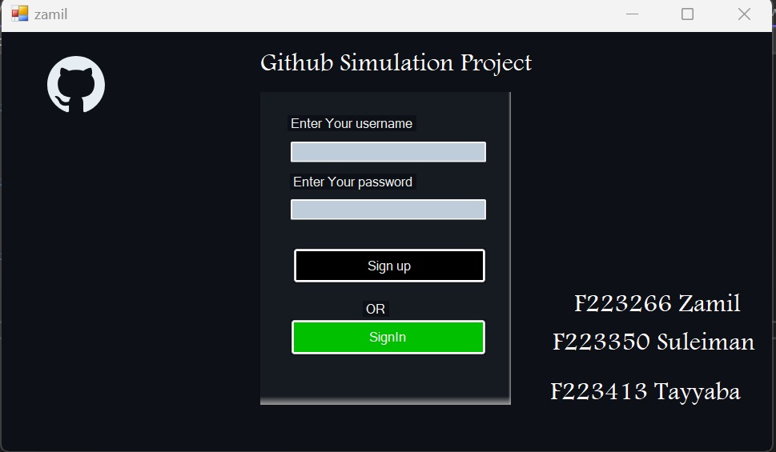
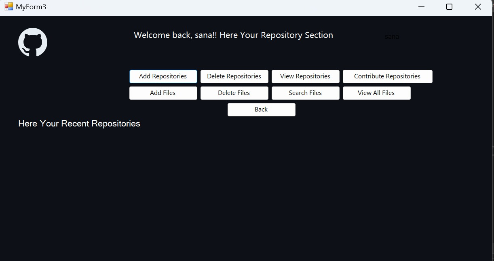
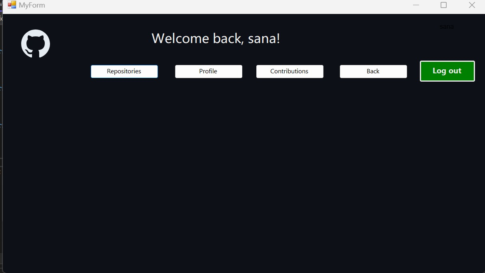
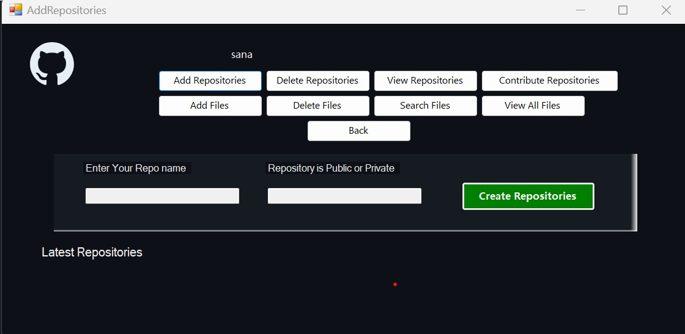
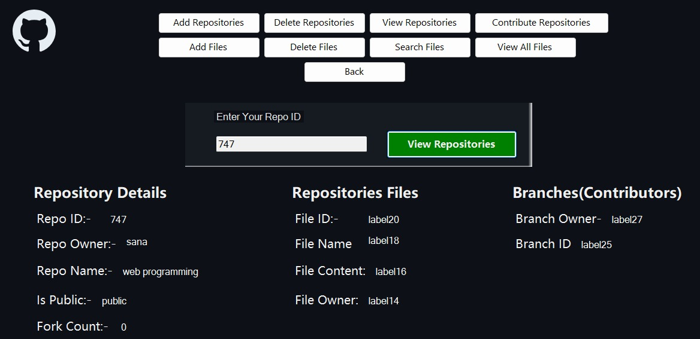
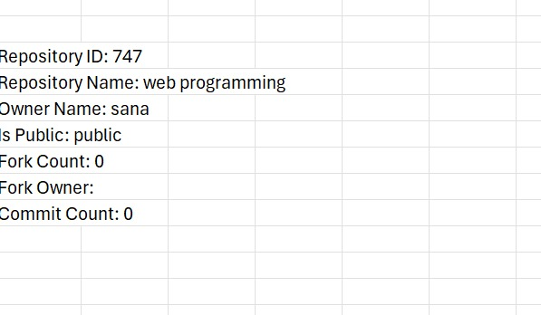

# Github Simulation Using C++ and Windows Form

### Contributers:
                  Muhammad Zamil Khalid     (22F-3266)
                  Muhammad Suleman          (22F-3350)
                  Tayyaba Javed             (22F-3413)

This project is a basic GUI-based simulation of GitHub using C++ and Windows Form. It aims to provide users with an intuitive interface to interact with GitHub-like functionalities locally on their machines.

## Features

- **User Authentication**: Users can log in with their credentials to access their GitHub account.
- **Repository Management**: Create, clone, fork, and manage repositories.
- **Commit**: Make commits and push changes to repositories.
- **Branch Management**: Create, switch, and manage branches within repositories.

## Prerequisites

- **Windows OS**: This project is designed to run on Windows.
- **Visual Studio**: Ensure you have Visual Studio installed to build and run the project.

## Installation

1. Clone or download the repository to your local machine.
2. Open the solution file (`GitHubSimulation.sln`) in Visual Studio.
3. Build the solution to compile the project.
4. Run the compiled executable to launch the GitHub simulation.

## Usage

1. Launch the application.
2. Log in with your GitHub credentials or create a new account if you don't have one.
3. Explore the available functionalities through the intuitive GUI.
4. Perform actions such as creating repositories, making commits, and managing pull requests.
5. Experiment with different features to get a feel for the GitHub simulation.

## Contributing

Contributions are welcome! If you'd like to contribute to this project, please follow these steps:

1. Fork the repository.
2. Create your feature branch (`git checkout -b feature/YourFeature`).
3. Commit your changes (`git commit -am 'Add some feature'`).
4. Push to the branch (`git push origin feature/YourFeature`).
5. Create a new Pull Request.

## License

This project is licensed under the MIT License - see the [LICENSE](LICENSE) file for details.

## Support

For any inquiries or support regarding this project, feel free to contact the maintainers:

- [Muhammad Zamil Khalid](https://github.com/iamZamil)
- [Muhammad Suleman](https://github.com/sulemaniftikhar)
- [Tayyaba Javed](f223413@cfd.nu.edu.pk)

We appreciate your interest and support!

---

## Screenshots

  
*Log-in and Sign-up Page*

---

  
*Main Interface*

---

  
*User Repositories*

---

  
*Creating Repository*

---

  
*Searching Repository*

---

  
*User's Data Base*

---
